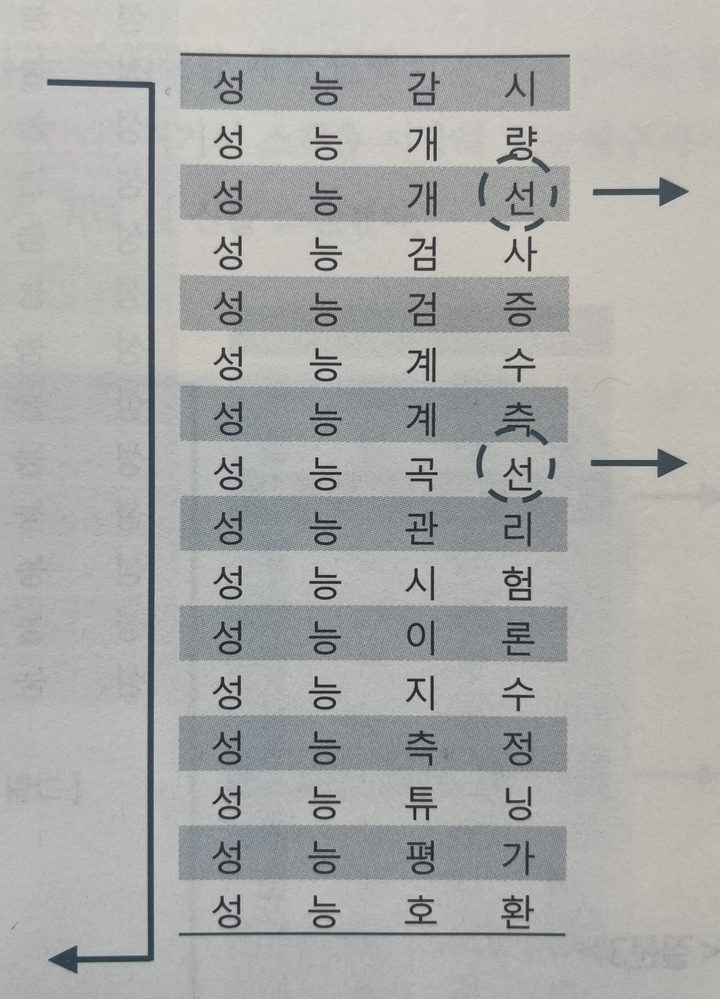
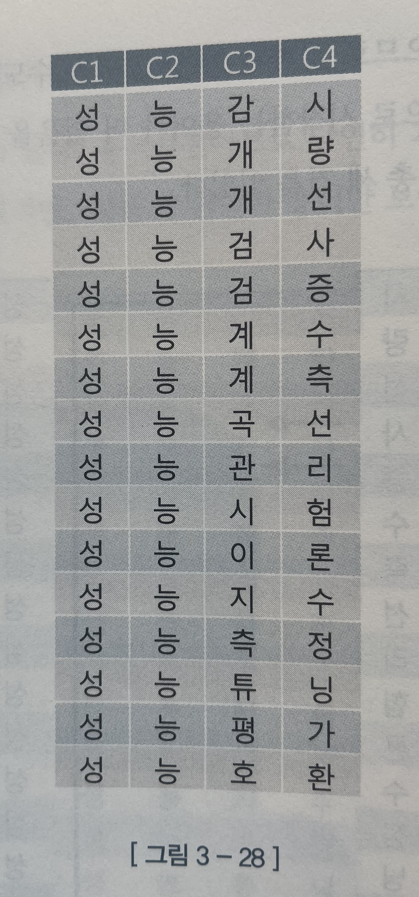
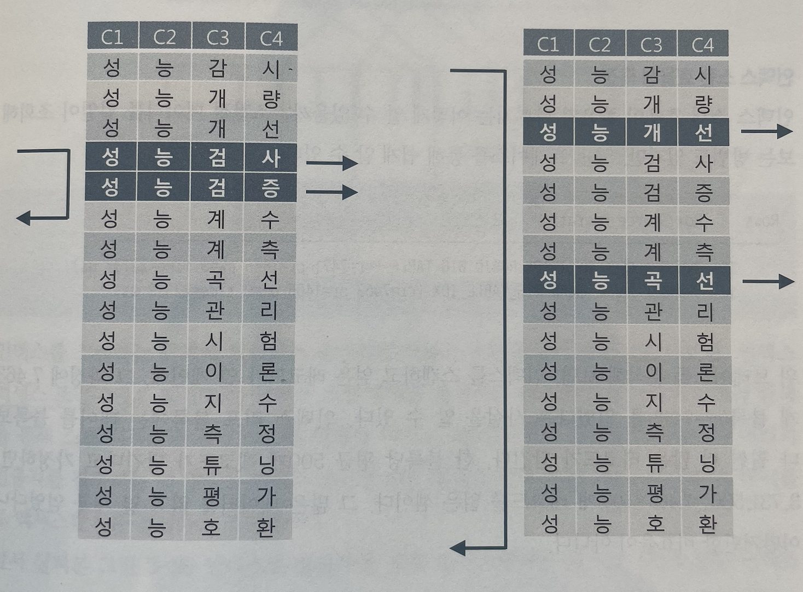
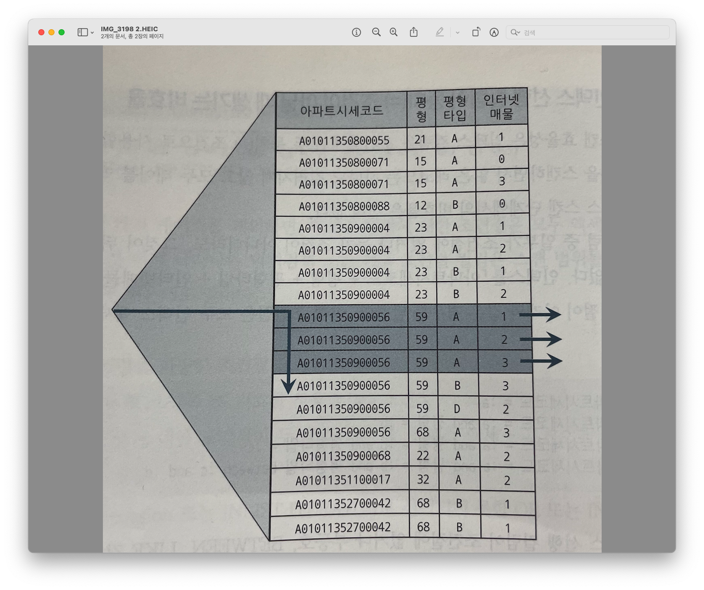

# 3장: 인덱스 튜닝

## 3.1 테이블 액세스 최소화
- 테이블 랜덤 액세스가 성능에 미치는 영향

### 3.1.1 테이블 랜덤 액세스
#### **인덱스에 대한 맹신 또는 섣부른 자신감**
인덱스를 사용하면 빠르다고 생각되었던 것이 대량 데이터를 조회하는 순간 테이블 전체를 스캔할 때 보다 느려지는 경우가 있다. 이러한 이유에 대해 알아보자.

#### **인덱스 ROWID는 물리적 주소? 논리적 주소?**
* 인덱스를 스캔하는 이유?
  * 검색 조건을 만족하는 소량의 데이터를 빨리 찾아 테이블 레코드를 찾아가기 위한 주소값(ROWID)을 얻기 위해

* 인덱스 ROWID는 물리적 주소보다 논리적 주소에 가깝다.
  * 테이블 레코드를 찾아가기 위한 논리적 주소 정보를 담고 있기 때문
  * C의 포인터와 같이 직접적인 물리주소를 담고 있지 않다.

> ROWID는 도서 색인에 비유하자면 색인에 기록된 페이지 번호로 볼 수 있다.

#### **메인 메모리 DB와 비교**
- 메인 메모리 DB
  - 인스턴스 기동시 디스크에 저장된 데이터를 버퍼캐시로 로딩하고 인덱스를 생성
  - 디스크 상의 주소정보를 갖는 게 아닌 메모리상의 주소정보(포인터)를 가짐
  - 인덱스를 경유하고 테이블을 액세스하는 비용이 디스크 DB와 비교해 매우 낮다.

디스크 DB는 포인터가 아닌 디스크 주소 정보(DBA, Data Block Address)를 이용해 해시 알고리즘으로 버퍼 블록을 찾아간다.

#### **I/O 메커니즘 복습**
- DBA(데이터 파일 번호 + 블록 번호)는 디스크 상에서 블록을 찾기 위한 주소 정보
- I/O 성능을 높이기 위해 버퍼캐시를 잘 활용

1. 블록을 읽을 때 디스크로 가기 전 버퍼캐시를 체크한다.
2. 읽고자 하는 DBA를 해시 함수에 입력해 해시 체인을 찾고 거기서 버퍼 헤더를 찾는다.
3. 버퍼 헤더는 항상 같은 해시 체인에 연결
4. 실제 데이터가 담긴 버퍼 블록은 매번 다른 위치에 캐싱
   * 메모리 주소값을 버퍼 헤더가 가지고 있다.

해싱 알고리즘으로 버퍼 헤더를 찾고, 거기서 얻은 포인터로 버퍼 블록을 찾아간다.

* 인덱스로 테이블 블록을 액세스할 때
  1. 리프 블록에서 읽은 ROWID를 분해
  2. DBA 정보 획득
* 테이블을 Full Scan 할 때
  1. 익스텐트 맵을 통해 블록들의 DBA 정보 획득

#### **인덱스 ROWID는 우편주소**
디스크 DB(일반 DBMS)가 사용하는 ROWID를 우편주소, 
메인 메모리 DB가 사용하는 포인터를 전화번호에 비유가 가능하다. (전화번호로 직접 전화를 걸면 연결이 가능하지만 우편주소는 그렇지 않다.)
> ROWID: 7번 데이터 파일 123번 블록에 저장된 10번째 레코드


### 3.1.2 인덱스 클러스터링 팩터
* 클러스터링 팩터(Clustering Factor, CF): 군집성 계수, 특정 컬럼을 기준으로 같은 값을 갖는 데이터가 서로 모여있는 정도
* CF가 좋은 컬럼에 생성한 인덱스는 검색 효율이 매우 좋다.

> 인덱스 ROWID로 테이블을 액세스 할 때, 래치 획득과 해시 체인 스캔 과정을 거치는데 테이블 블록에 대한 포인터를 바로 해제하지 않고 버퍼 Pinning으로 유지한다. 이 상태에서 다음 인덱스 레코드를 읽었는데 이전과 같은 테이블 블록을 가리키면 래치 획득, 해시 체인 스캔과정을 생략하고 바로 읽어 논리적인 블록 I/O 과정을 생략할 수 있다.

### 3.1.3 인덱스 손익 분기점
인덱스 ROWID를 이용한 테이블 액세스는 고비용 구조이기 때문에 읽어야 할 데이터가 일정량을 넘는 순간 Table Full Scan 보다 오히려 느리다.

> Table Full Scan은 1,000만 건 중 한 건을 조회하든, 10만 건을 조회하든 차이가 없다.

**Table Full Scan 보다 느려지게 만드는 핵심 요인**
- Table Full Scan은 시퀀셜 액세스, 인덱스 ROWID를 이용한 테이블 액세스는 랜덤 액세스 방식
- Table Full Scan은 Multiblock I/O, 인덱스 ROWID를 이용한 테이블 액세스는 Single Block I/O

#### **온라인 프로그램 튜닝 vs. 배치 프로그램 튜닝**


### 3.1.4 인덱스 컬럼 추가
테이블 액세스 최소화를 위해 가장 일반적으로 사용하는 튜닝 기법은 인덱스에 컬럼을 추가하는 것

인덱스 구성을 다시하는 것 보다 기존 인덱스에 필요한 컬럼을 추가하는 것만으로 큰 효과를 얻을 수 있다.
(인덱스 스캔량은 줄지 않지만, 테이블 랜덤 액세스 횟수를 줄여준다.)

**테이블 액세스 단계 필터 조건에 의해 버려지는 레코드가 많을 때, 인덱스에 컬럼을 추가함으로써 얻는 
성능 효과가 있다.**

### 3.1.5 인덱스만 읽고 처리
- 필터 조건에 의해 버려지는 레코드가 거의 없다면?
쿼리에 사용된 컬럼을 모두 인덱스에 추가햇 테이블 액세스가 발생하지 않도록 고려해야 한다.

> 추가해야 할 컬럼이 많아 실제 적용하기 곤란한 경우가 많다.

* Covered 쿼리: 인덱스만 읽어서 처리하는 쿼리
* Covered 인덱스: 쿼리에 사용한 인덱스를 부른다.


#### **Include 인덱스**
일반 인덱스는 생성 시 컬럼 모두 루트와 브랜치 블록에 저장하지만, `include` 옵션을 주고 생성한 인덱스는 특정 컬럼을 리프 블록에만 저장한다.

### 3.1.6 인덱스 구조 테이블
랜덤 액세스가 발생하지 않도록 테이블을 인덱스 구조로 생성
(IOT 구조: Index-Organized Table)

IOT는 인덱스 리프 블록이 곧 데이터 블록이다.

일반 힙 구조 테이블에서는 데이터를 입력할 때 랜덤 방식을 사용하는 반면에 IOT는 인덱스 구조 테이블이므로 정렬 상태를 유지하며 데이터를 입력한다. (CF를 좋게 만드는 방법)

### 3.1.7 클러스터 테이블
- 인덱스 클러스터
- 해시 클러스터

#### **인덱스 클러스터 테이블**
특정 컬럼의 값(=클러스터 키)이 같은 레코드를 한 블록에 모아서 저장하는 구조.
- 한 블록에 모두 담을 수 없을 때 새로운 블록을 할당해서 클러스터 체인으로 연결

#### **해시 클러스터 테이블**
인덱스를 사용하지 않고 해시 알고리즘을 사용해 클러스터를 찾아간다.

## 3.2 부분범위 처리 활용
- 테이블 랜덤 액세스로 인한 인덱스 손익분기점의 한계를 극복하는 히든카드 소개

### 3.2.1 부분범위 처리
전체 쿼리 결과집합을 연속적으로 전송하지 않고 사용자로부터 Fetch Call이 있을 때마다 일정량씩 나누어 전송하는 것

**JAVA 프로그램이 데이터를 읽어 들이는 메커니즘**
- Array Size의 기본값은 10
- Statement 객체의 setFetchSize 메소드를 통해 변경 가능

1. `rs.next()` 호출 시 Fetch Call을 통해 전송받은 데이터 10건을 클라이언트 캐시에 저장
2. 이후 `rs.next()` 호출할 때는 Fetch Call 발t생하지 않고 캐시에서 데이터를 읽는다.
3. 캐이에 저장한 데이털르 모두 소진한 상태에서 `rs.next()` 호출 시 추가 Fetch Call을 통해 10건을 전송 받음
4. 다 읽을 때 까지 1~3번 과정을 반복


#### **정렬 조건이 있을 때 부분범위 처리**
```java
Statement stmt = con.createStatement();
ResultSet rs = stmt.executeQuery("select name from big_table order by created")
```

모든 데이터를 다 읽어 `created` 순으로 정렬을 마치고서야 전달이 가능하다.

다행히 `created` 컬럼이 선두인 인덱스가 있으면 부분범위 처리가 가능하다.


#### **Array Size 조정을 통한 Fetch Call 최소화**
- 대량 데이터를 받는 경우
  - Array Size를 조정한다고해서 전송해야 하는 총량이 변하지는 않지만, Fetch Call 횟수를 줄일 수 있다.

- 앞쪽 일부 대이터만 Fetch하다가 멈추는 경우
  - Array Size를 작게 설정
  - 불필요하게 많은 데이터를 전송하고 버리는 비효율을 줄여주기 때문

#### **쿼리 툴에서 부분범위 처리**
중간에 멈췄다가 사용자의 추가 요청이 있을 때마다 데이터를 가져오도록 구현되어있는 툴이 있고 없는 툴도 있다.


### 3.2.2 부분범위 처리 구현


### 3.2.3 OLTP 환경에서 부분범위 처리에 의한 성능개선 원리
- OLTP: Online Transaction Processing
  - 온라인 트랜잭션을 처리하는 시스템
  - 온라인 트랜잭션은 일반적으로 소량 데이터를 읽고 갱신하는 특징

인덱스를 잘 구성하면 Sort Order By 연산을 생략할 수 있다.

빠른 응답을 위해서는 인덱스를 이용해 소트 연산을 생략할 수 있어야 한다.

#### **멈출 수 있어야 의미있는 부분범위 처리**
- 앞쪽 일부만 출력하고 멈출 수 있는가?

단위 작업을 마치고 커넥션을 커넥션 풀에 반환해야 하므로 결과 집합을 조금씩 나눠 전송하도록 구현하기 어렵다.

자세한 내용은 [5장](./ch05/README.md)에 있다.

#### **배치 I/O**
테이블 블록에 대한 디스크 I/O Call을 미뤘다가 읽을 블록이 일정량 쌓이면 한꺼번에 처리한다.

#### **데이터 정렬 이슈**
배치 I/O 기능이 작동하면 인덱스를 이용해서 출력하는 데이터 정렬 순서가 매번 다를 수 있다.

인덱스 정렬 순서를 믿고 ORDER BY를 생략하는 개발 패턴은 사용하지 않아야 한다.

---

## 3.3. 인덱스 스캔 효율화
- 인덱스 컬럼 추가 튜닝 기법 이외에도 다양한 튜닝 기법
- SQL 작성 시 주의할 내용
### 3.3.1 인덱스 탐색
- 인덱스 탐색 과정(수직적 탐색, 수평적 탐색)을 깊이있게

**인덱스 구조 복습**

- LMC: Leftmost Child
  - 자식 노드 중 가장 왼쪽 끝에 위치한 블록
  - 루트 블록의 첫 번째 키 값보다 작거나 같은 값을 갖는 레코드가 저장


#### **조건절1**
`WHERE C1 = 'B'`


C1이 B인 첫 번째 레코드를 찾고 'C'를 만나는 순간 스캔을 멈춘다.

> 세번째 리프 블록으로 바로 내려가는 게 아닌 직전 블록에도 'B'를 찾을 수 있으므로 리프 블록 2부터 스캔을 시작한다.

#### **조건절2**
`WHERE C1 = 'B'`

`AND   C2 = 3`

C2 = 4인 레코드를 만나는 순간 스캔을 멈춘다.

C1과 C2 조건절 모두 스캔 시작과 끝 지점을 결정하는 역할을 함

#### **조건절3**
`WHERE C1 = 'B'`

`AND   C2 >= 3`

C1 = 'C'인 레코드를 만날 때까지 스캔하다가 멈춘다.

`C2 >= 3` 스캔을 멈추는 데는 역할을 못했지만, 스캔 시작점이 달라졌다.

#### **조건절4**
`WHERE C1 = 'B'`

`AND   C2 <= 3`

C2 > 3인 첫 번째 레코드를 만나는 순간 스캔을 멈춘다.

`C2 <= 3` 조건은 은 스캔 시작점을 결정하는 데 역할을 못했지만 스캔을 멈추는 데 중요한 역할을 함

#### **조건절5**
`WHERE C1 = 'B'`

`AND   C2 BETWEEN 2 AND 3`

C2 > 3인 첫 번째 레코드를 만나는 순간 스캔을 멈춘다.

C1과 C2 조건절 모두 스캔 시작과 끝 지점을 결정하는 역할을 함

#### **조건절6**
`WHERE C1 BETWEEN 'A' AND 'C'`

`AND   C2 BETWEEN 2 AND 3`


C1이 'C'이고 C2 = 3인 레코드보다 값이 큰 레코드를 만나느 순간 스캔을 멈춘다.

C2는 C1 = 'B'인 중간 구간에서 스캔 시작과 끝 지점을 결정하는 데 역할을 못했다.

### 3.3.2 인덱스 스캔 효율성
용어 사전에서 검색을 하는 경우 예시

||
|---|
|성 능 감 시|
|성 능 개 량|
|성 능 개 선|
|**성 능 검 사**|
|**성 능 검 증**|
|**성 능 계 수**|
|성 능 계 측|
|성 능 곡 선|
|성 능 관 리|
|성 능 시 험|
|성 능 이 론|
|성 능 지 수|
|성 능 측 정|
|성 능 튜 닝|
|성 능 평 가|
|성 능 호 환|
||

#### 1) '성능검'으로 시작하는 용어를 검색하는 경우
- 두 건을 얻기 위해 총 세건을 읽는다.

#### 2) '성능'으로 시작하고 네 번째 문자가 '선'인 용어를 검색할 때


결과는 똑같이 두 건이지만, 더 많은 용어를 스캔해야만 한다.


#### 문자를 하나씩 인덱스로 나눈 경우


#### 3) '성능검'으로 시작하는 레코드를 검색
```SQL
where c1 = '성'
and   c2 = '능'
and   c3 = '검'
```
#### 4) '성능'으로 시작하고 네 번째 컬럼이 '선'인 레코드 검색 
```SQL
where c1 = '성'
and   c2 = '능'
and   c4 = '선'
```


질문 3의 경우 총 두 건을 얻기 위해 세 건을 스캔했다.

질문 4의 경우도 마찬가지 결과는 똑같이 두 건이지만, 훨씬 더 많은 인덱스 레코드를 스캔해야만 한다.


#### **스캔을 통해 얻은 결과는 같은데 리프 블록에서 스캔하는 레코드 개수에 차이가 나는 이유**


- 인덱스 선행 컬럼이 조건절에 없기 때문
  - 질문4에서 C4보다 앞선 선행 컬럼 C3가 조건절에 없다.
- '=' 조건이 아닌 경우
  
위 조건에 해당되면 스캔 과정에 비효율이 발생한다.

> - 선두 컬럼: '맨 앞쪽'에 있는 컬럼을 지칭
> - 선행 컬럼: '상대적으로 앞쪽에' 놓인 컬럼을 지칭

### 3.3.3 액세스 조건과 필터 조건
인덱스를 스캔하는 단계에서 처리하는 조건절
- 액세스 조건
- 필터 조건

1. 인덱스 액세스 조건: 인덱스 스캔 범위를 결정하는 조건절
   - 수직적 탐색을 통해 스캔 시작점을 결정하는 데 영향을 미침
   - 리프 블록을 스캔하다가 어디서 멈출지를 결정하는 데 영향을 미침

2. 인덱스 필터 조건: 테이블로 액세스할지를 결정하는 조건절
   - 테이블 액세스 단계에서 처리되는 조건절
3. 테이블 필터 조건: 쿼리 수행 다음 단계로 전달하거나 최종 결과집합에 포함할지를 결정 

### 3.3.4 비교 연산자 종류와 컬럼 순서에 따른 군집성


**선행 컬럼이 모두 '`=`' 조건인 상태에서 첫 번째 나타나는 범위검색 조건까지만 만족하는 인덱스 레코드는 모두 연속해서 모여있지만, 그 이하 조건까지 만족하는 레코드는 비교 연산자 종류에 상관없이 흩어진다.**

```SQL
-- 조건절 1
where C1 = 1
and   C2 = 'A'
and   C3 = '나'
and   C4 = 'a'
```
인덱스 구성 컬럼 모두 '`=`' 조건으로 비교했을 때 레코드들이 모두 연속(5~7)해서 모여있다.


```SQL
-- 조건절 2
where C1 = 1
and   C2 = 'A'
and   C3 = '나'
and   C4 >= 'a'
```
선행 컬럼은 모두 '`=`'이고 마지막 컬럼은 범위검색 조건(부등호, BETWEEN, LIKE)으로 조회한 결과는 연속(5~10)해서 모여 있다.


```SQL
-- 조건절 3
where C1 = 1
and   C2 = 'A'
and   C3 between '가' and '다'
and   C4 = 'a'
```
선행 컬럼은 모두 '`=`'이고 C3이 범위검색 조건인 경우 C1 ~ C3까지는 모여있고 (2~12)
C4 조건까지 만족하는 레코드는 흩어지게 된다. (2, 3, 5, 6, 7, 11)


```SQL
-- 조건절 4
where C1 = 1
and   C2 <= 'B'
and   C3 = '나'
and   C4 between 'a' and 'b'
```
C1 ~ C2 까지의 조건은 모여있고 (2~16) C3, C4 조건을 만족하는 레코드는 흩어지게 된다. (5, 6 7, 8, 9, 14, 15)


**가장 선두 컬럼이 범위검색 조건이면, 그 조건이 스캔 범위를 결정한다.**
```SQL
-- 조건절 5
where C1 between 1 and 3
and   C2 = 'A'
and   C3 = '나'
and   C4 = 'a'
```

위 모든 조건절을 액세스 조건과 필터 조건으로 구분하면 다음과 같다.
||인덱스 액세스 조건|인덱스 필터 조건|
|---|---|---|
|조건절 1|C1, C2, C3, C4||
|조건절 2|C1, C2, C3, C4||
|조건절 3|C1, C2, C3|C4|
|조건절 4|C1, C2|C3, C4|
|조건절 5|C1|C2, C3, C4|
|||

### 3.3.5 인덱스 선행 컬림이 등치(=) 조건이 아닐 때 생기는 비효율
- 스캔 효율성은 인덱스 컬럼을 조건절에 모두 '`=`'으로 사용할 때 가장 좋다.
  - 스캔하면서 읽은 레코드는 하나도 걸러지지 않고 모두 테이블 액세스로 이어지기 때문
  - 비효율이 없다

반면, **인덱스 선행 컬럼이 조건절에 없거**나 **범위검색 조건**(부등호, BETWEEN, LIKE)이면 스캔하는 단계에서 비효율이 발생한다.

```SQL
...
where 아파트시세코드 = 'A01011350900056'
and 평형 = '59'
and 평형타입 = 'A'
and 인터넷매물 between '1' and '3'
...
```

위 SQL에서는 BETWEEN 조건이 있지만 선행 컬럼들이 모두 '`=`' 조건이기 때문에 비효율 없이 스캔을 통해 빠르게 찾는다.


* 인덱스 구성을 다르게 한 경우

  - 비효율 발생
  - 중간에 걸친 값 `인터넷매물 = '2'` 구간에서는 전체 레코드를 다 읽는다.

### 3.3.6 BETWEEN을 IN-List로 전환
인덱스를 변경하면 좋겠지만 운영 환경에서 인덱스 구성을 바꾸기는 쉽지 않다.

이럴 때 아래와 같이 변경하면 효과가 있다.
```SQL
where 인터넷매물 in ('1', '2', '3')
and 아파트시세코드 = 'A01011350900056'
and 평형 = '59'
and 평형타입 = 'A'
```

* INLIST OPERATOR 오퍼레이션이 발생하므로 3개의 수직적 탐색이 발생한다.
  * ```SQL
    where 인터넷매물 = '1'
    and 아파트시세코드 = 'A01011350900056'
    and 평형 = '59'
    and 평형타입 = 'A'
    ```
  * ```SQL
    where 인터넷매물 = '2'
    and 아파트시세코드 = 'A01011350900056'
    and 평형 = '59'
    and 평형타입 = 'A'
    ```
  * ```SQL
    where 인터넷매물 = '3'
    and 아파트시세코드 = 'A01011350900056'
    and 평형 = '59'
    and 평형타입 = 'A'
    ```
  * 선두 컬럼에 BETWEEN을 사용할 때 보다 모든 컬럼을 '`=`'조건으로 검색하는 것이 더 효율적이다.

#### **BETWEEN 조건을 IN-List로 전환할 때 주의 사항**
- IN-List 개수가 많으면 수직적 탐색이 많이 발생한다.
  - **리프 블록을 많이 스캔하는 비효율보다 IN-List 개수만큼 브랜치 블록을 반복 탐색하는 비효율이 더 클 수 있다.**

- 인덱스 스캔 과정에서 레코드들이 서로 멀리 떨어져 있을 때만 유용
  - 레코드들이 가까운 경우 IN-List로 변환해도 효과가 없거나 수직적 탐색 때문에 오히려 블록 I/O가 더 많이 발생

데이터 분포나 수직적 탐색 비용을 따져보고 변경하자
### 3.3.7 Index Skip Scan 활용

```SQL
create index IDX_NAME on TABLE_NAME(B, A);

```
```SQL
select /*+ INDEX_SS(t IDX_NAME) */ count(*)
from TABLE_NAME t
where A = 'A'
and B between '201801' and '201812'
```

- 굳이 조건절을 바꾸지 않고도 IN-List 조건과 같은 효과를 낼 방법이다.

### 3.3.8 IN 조건은 '='인가
**?**

### 3.3.9 BETWEEN과 LIKE 스캔 범위 비교
- `LIKE`보다 `BETWEEN`을 사용하는 게 낫다.
  - 정확히 스캔 범위를 지정해주기 때문

### 3.3.10 범위검색 조건을 남용할 때 생기는 비효율
```SQL
SELECT 고객ID, 상품명, 지역코드 ...
FROM 가입상품
WHERE 회사코드 = :com
AND 지역코드 = :reg
AND 상품명 LIKE :prod || '%'
```

```SQL
SELECT 고객ID, 상품명, 지역코드 ...
FROM 가입상품
WHERE 회사코드 = :com
AND 지역코드 LIKE :reg || '%'
AND 상품명 LIKE :prod || '%'
```

첫 번째는 적은 범위를 스캔하지만 두번째 쿼리는 상품명이 필터 조건으로 바뀌면서 넓은 범위를 스캔하게된다.

**쉽게 관리하기 위해 인덱스 컬럼에 범위검색 조건을 남용하면 인덱스 스캔 비효율이 발생한다**

### 3.3.11 다양한 옵션 조건 처리 방식의 장단점 비교
#### **OR 조건 활용**
?

#### **LIKE/BETWEEN 조건 활용**

1. 인덱스 선두 컬럼
   ```SQL
   -- 인덱스는 고객ID + 거래일자로 구성
   select * from 거래
   where 고객ID like :cust_id || '%'
   and 거래일자 between :dt1 and :dt2
   ```
   - 인덱스 선두 컬럼에 대한 옵션 조건을 LIKIE/BETWEEN 연산자로 처리하는 것은 금물
   - 고객ID 값을 입력하지 않을 시 모든 거래 데이터를 스캔하는 불상사가 발생

2. NULL 허용 컬럼
   ```SQL
   -- 인덱스는 고객ID + 거래일자로 구성
   select * from 거래
   where 고객ID like '%'
   and 거래일자 between :dt1 and :dt2
   ```
   - 실제 NULL값이 입력되어 있다면 데이터가 결과집합에서 누락된다.
3. 숫자형 컬럼
   ```SQL
   -- 인덱스는 고객ID + 거래일자로 구성
   select * from 거래
   where 거래일자 = :dt
   and 고객ID like :cust_id || '%'
   -- and to_char(고객ID) like :cust_id || '%'
   ```
   - 고객ID가 숫자형 컬럼이라면 자동 형변환이 발생하므로 인덱스 컬럼이 가공되어 Range Scan이 불가
4. 가변 길이 컬럼
  - LIKE를 옵션 조건에 사용할 때는 컬럼 값 길이가 고정적이어야 한다.
    - 예시) '김'을 조회하면 '김훈'도 같이 조회


#### **UNION ALL 활용**
```SQL
select * from 거래
where :cust_id is null
and 거래일자 between :dt1 and :dt2
union all
select * from 거래
where :cust_id is not null
and 고객ID = :cust_id
and 거래일자 between :dt1 and :dt2
```

- :cust_id에 값을 입력하든 안 하든, 인덱스를 가장 최적으로 사용
- SQL이 길어지는 단점

#### **NVL/DECODE 함수 활용**
```SQL
select * from 거래
where 고객ID = nvl(:cust_id, 고객ID)
and 거래일자 between :dt1 and :dt2

-- 또는

select * from 거래
where 고객ID = decode(:cust_id, null, 고객ID, :cust_id)
and 거래일자 between :dt1 and :dt2
```

### 3.3.12 함수호출부하 해소를 위한 인덱스 구성
#### **PL/SQL 함수의 성능적 특성**
- PL/SQL 사용자 정의 함수가 느린 이유 3가지
  - 가상머신(VM) 상에서 실행되는 인터프리터 언어
  - 호출 시마다 컨텍스트 스위칭 발생
    - SQL 실행엔진과 PL/SQL 가상머신 사이에 컨텍스트 스위칭이 일어난다.
  - 내장 SQL에 대한 Recursive Call 발생 (가장 결정적인 요소)
    - 함수에 SQL이 내장돼 있으면 그 SQL도 같은 횟수 실행
#### **효과적인 인덱스 구성을 통한 함수호출 최소화**


